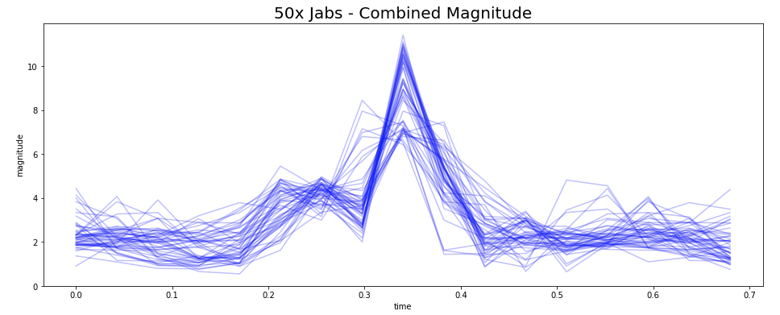
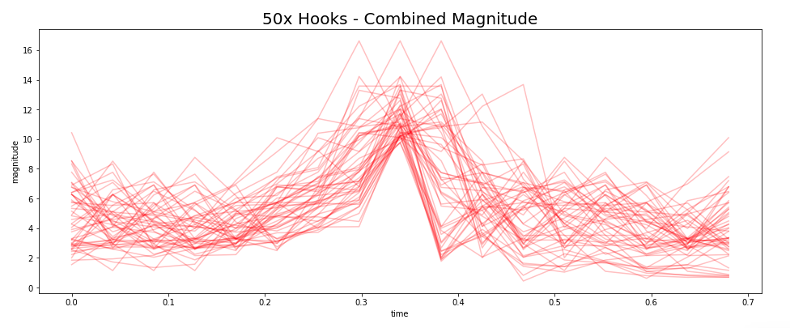
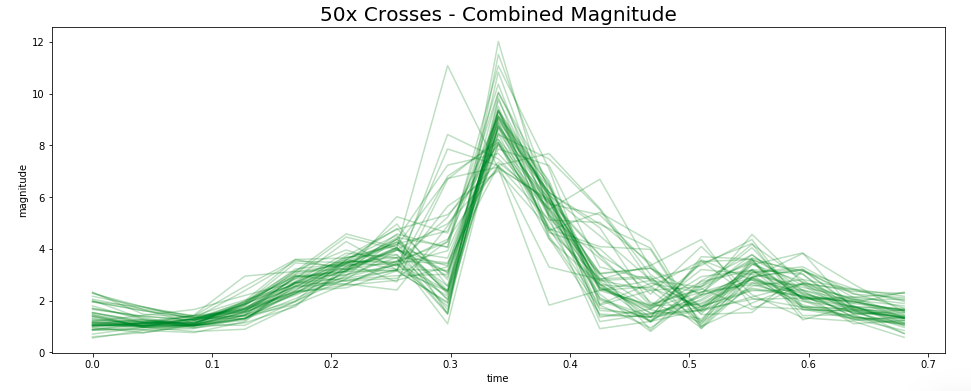

# fightclub
Boxing Workout Assistant

Purpose is to create a feedback system that gives the user insight into their boxing workout.

Goal is to measure quantitative attributes to each punch and classify each hit into a specific strike (jab, cross, hook, uppercut, etc.)

Will attach sensors to boxing gloves to track accelerometer data and gyroscopic data during the workout.

Data stream will then be analyzed post workout to determine quantity and quality of each strike.  
Future work includes making an app that can track and display results in real time from streaming data.

Will need to train a classification model to identify each punch event into it's specific strike category.
Since it is time series data, I want to use a recursive neural network to ID the punches.

Future use of data:
- Provide feedback to user about quality of workout and establish baseline data about fitness level at different points in time
- Combine with heart rate sensor to see relationship between fatigue and quality of hit
- Generate custom training workout regimine that is user specific
- Gamification of workouts based on user dealing a certain amount of "damage" to the bag
- Ideally be able to critique form when compared to professionals and recommend exercises and drills to improve
- 

## Initial Data

Event identification by combining overall magnitude of accerations to determine a punch

## Comparison of Different Strikes - Combined Magnitude Accelerometer

### Jab

### Hook

### Cross

## Comparison of Different Strikes - Gyroscopic Data

### Jab

### Hook

### Cross
