# What the Punch?
## Boxing Workout Assistant

## Overview
How do the top performing athletes get to the top of their game and consistently improve their performance?

They look at the data.

Quantification of workouts and training allows the athlete to identify strengths, weaknesses, and improvements of their chosen craft.

The purpose of this capstone is to create a feedback system that gives the user insight into their boxing workouts.

Main focus from a data science perspective is to measure quantitative attributes to each punch and classify each signature into a specific strike (jab, cross, hook, uppercut, etc.) using a Tensor Flow based LSTM Recursive Neural Network.

Data stream will then be analyzed post workout to determine quantity and quality of each strike.  

Future work includes making an app that can track and display results in real time from streaming data.

## Potential use of system:
- Provide feedback to user about quality of workout and establish baseline data about fitness level at different points in time
- Combine with heart rate sensor to see relationship between fatigue and quality of hit
- Generate custom training workout regimine that is user specific
- Gamification of workouts based on user dealing a certain amount of "damage" to the bag
- Ideally be able to critique form when compared to professionals and recommend exercises and drills to improve

# Project Workflow

## DATA GATHERING METHODOLOGY

In order to gather data about punches, a typical set of 12oz boxing gloves were expertly fitted with sensors that captured 3 axis of accelerometer data and gyroscopic data that synced via bluetooth to a smartphone.  Data was recorded at a rate of 25Hz.

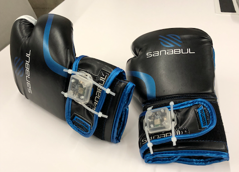

The data is then backed up to a cloud service and downloaded locally for processing.

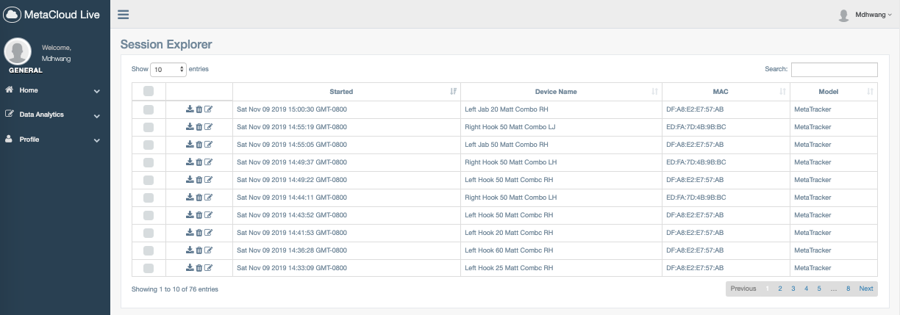

Sensors were purchased from www.mbientlab.com

Scope that behind the scenes action:

## Initial Data

Here is an example of what an workout session consisting of 100 left hand jabs looks like:

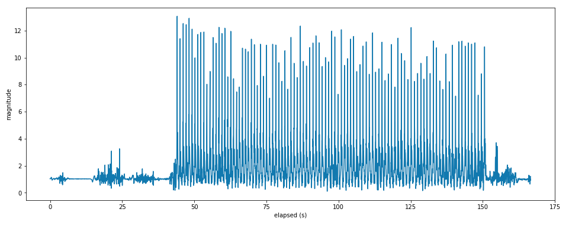

The overall magnitude of acceleration was calculated by combining info from each X, Y, and Z axis.

Let's zoom into a smaller example of a session consisting of only 10 jabs.

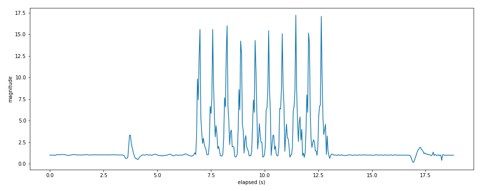

Punch "event" occurrances can be easily identified by looking for the spikes in magnitude of overall acceleration.  We can then record the timestamp of each of these events.

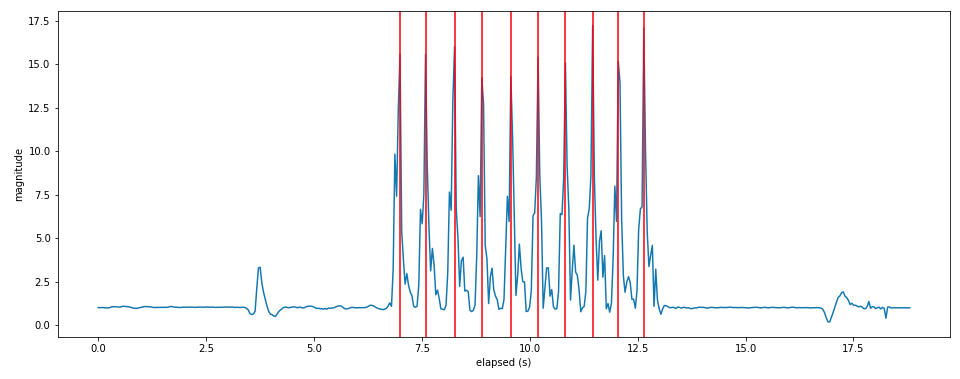

If we zoom into each punch occurance and take a snapshot of the window of events slightly prior and post the peak magnitude event, we can determine a signature of this event to be classified into a specific strike and determine other metrics such as impact force and hand speed.  Initial value of 8 data points prior and after chosen based on theoretical max frequency of punches.  This translates to a window of 0.68 seconds centered on the peak magnitude.

Basically, at this point we know a punch occurred, but we don't know what kind.

Begging the question...

### What The Punch?

## Comparison of Different Strikes - Combined Magnitude Accelerometer

Let's take a look at the combined magnitude of multiple occurrances of specific punches overlaid on top of each other:

### Left Jab
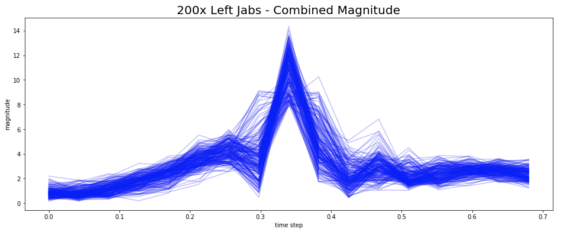

### Right Cross
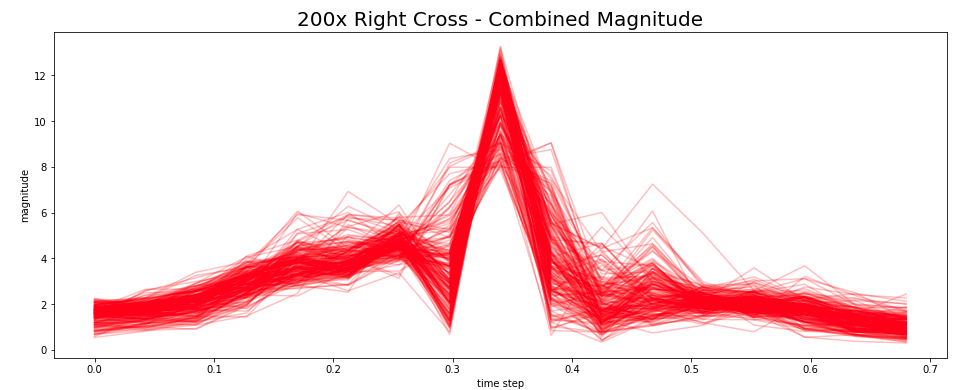

### Left Hook
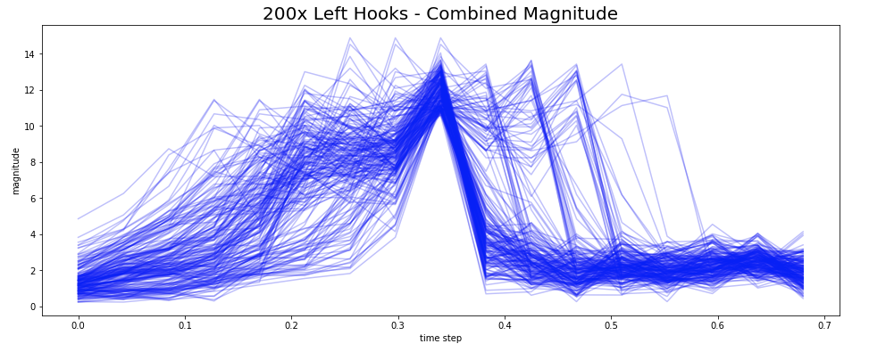

### Right Hook
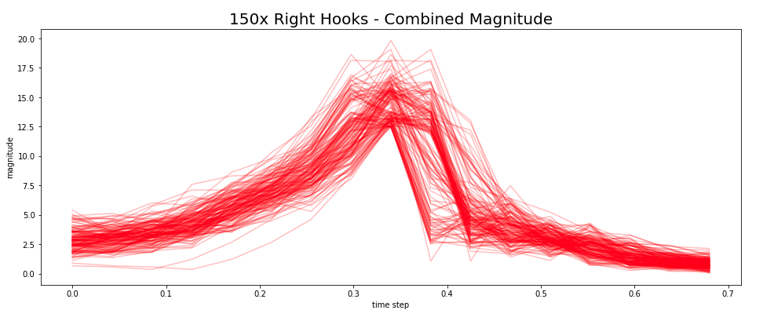

Note: These are COMBINED magnitudes of acceleration from 3 axes and shown for demonstrational purposes.  The classification model discussed later will take data inputs of the individual axis separately to not lose any info.  Also, variace of the left hook data could stem from windowization of the events.  Will be discussed in the future work section.

## Comparison of Different Strikes - Gyroscopic Data

Angular acceleration is also captured by the sensor.  In the below graphs, blue corresponds to deg/s in the X-Axis, red to Y, green to Z.

### Jab
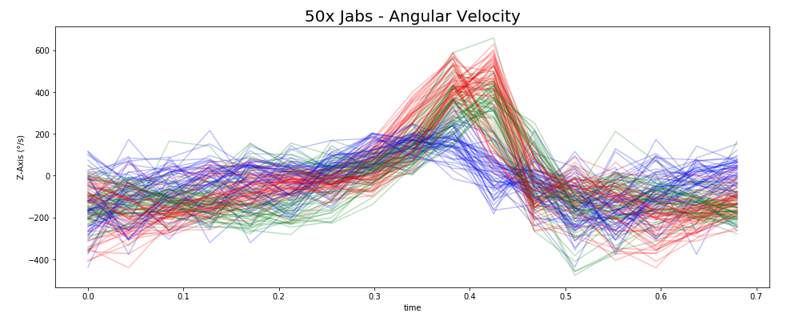

### Hook
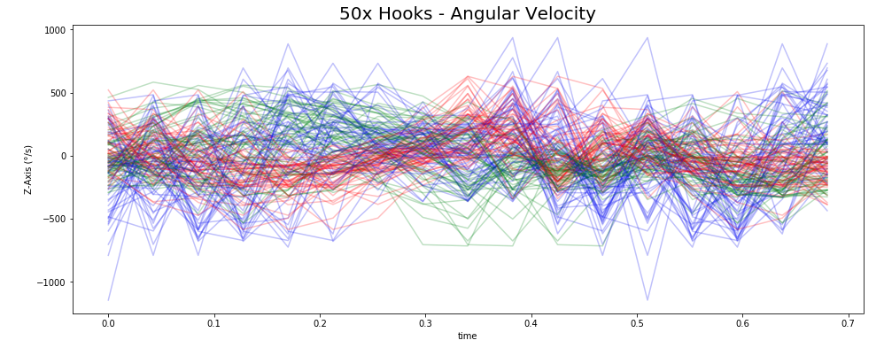

### Cross
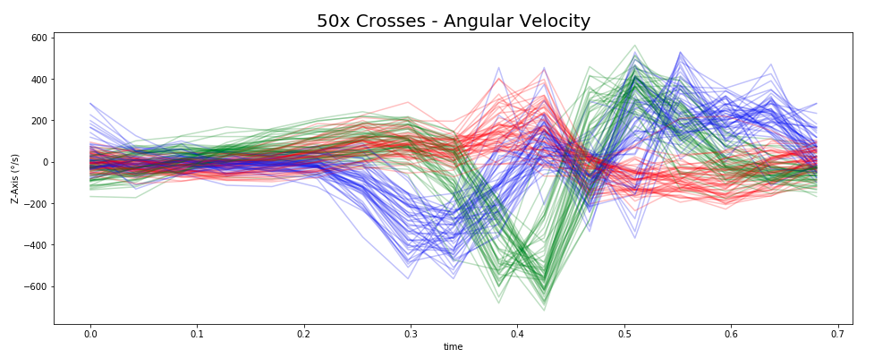

Common signatures for each strike can be visually identified already.  Should be light work for the TF LSTM RNN.

## DATA PROCESSING

In the one week timeframe of this project, ~4000 punches were recorded from 10 individuals across ~70 sessions to create the intial dataset of 4 unique punches.  Shoutout to my Galvanize Fam.

Cleaning Workflow:
- Accelerometer and Gyroscopic data were combined for each session
- Events were identified and windows were recorded
- Processed session info was pickled and stored for future use

All of this is automated via the cleaning_data.py and folder organization.

Selected data can then be loaded into a single list for further processing prior to modeling.  This is to achieve flexibility for various tests (selected punches only / selected users only / other things you can think of / etc.)

Pickled data is put into the "load data" directory to be picked up automatically by the load_data.py script which proceeds to:

- Combine all data into a single numpy array
- Standardize data 
- Generate labels

At this point we are ready to feed the model.

## MODELING

Since we are concerned with time series data, we are going to a Tensor Flow Long Short Term Memory Recursive Neural Network (TFLSTMRNN) as a trained classification model to pick up on the unique signatures of each strike and classify them.

But what do these models eat?  Time series data fed in predetermined batches:

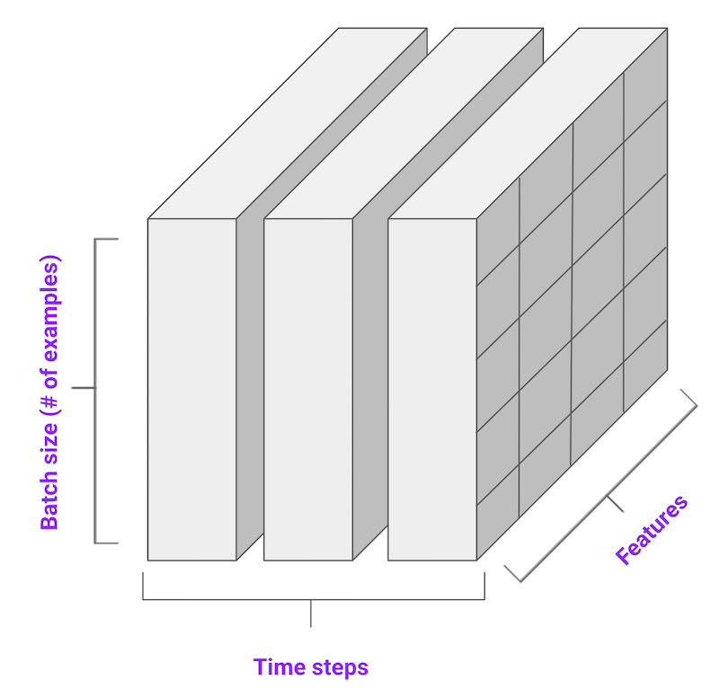

source: tensorflow.org

My model has 6 features (XYZ Accel, XYZ Gyro), time steps of 17 (8 steps before and after peak magnitude), and batch of 20 (based on limited 4000 total available data points)

Architecture of the model can be seen below:

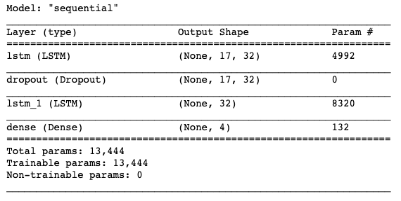

Each LSTM layer utilizes a softmax activation function and an internal dropout rate of 0.5

The dropout layer between the LSTM layers is also set to 0.5

The model is compiled with an RMSProp optimizer and a loss function of sparse categorical entropy.

Model was fed with a 70 / 30 stratified train and test split.

After 100 epochs, the model achieves 95% accuracy on the validation test data.

Model is stored in /models folder for future use.

Hooray!

## WHAT DO WE DO NOW?

With the classification model scoring high, we can set our sights back on the original case of quantifying each strike performed during the workout.

Unfortunately this is where the story ends (as of Nov 10, 2019)

### Future Work Includes:
- Training a neural net to determine how many strikes occur during a variable length / intensity workout.
    - Current test data had sessions with predetermined number of strikes which is hard coded
    - Current method to locate events has inherent error based on sensor frequency.  If frequency is raised, current methodology will be unusable.  See exhibit A below
- Calculate other metrics aside from classification of strike such as force and hand speed.
- Think about trend data throughout workout
    - Combine with heart rate monitor to gauge fatigue and relationship to quality of strike
- Use Mbient Lab tools to make mobile app with live feedback and stats
- Experimenting with additional strikes and sensor options (increasing Hz on sensor for more granular data)

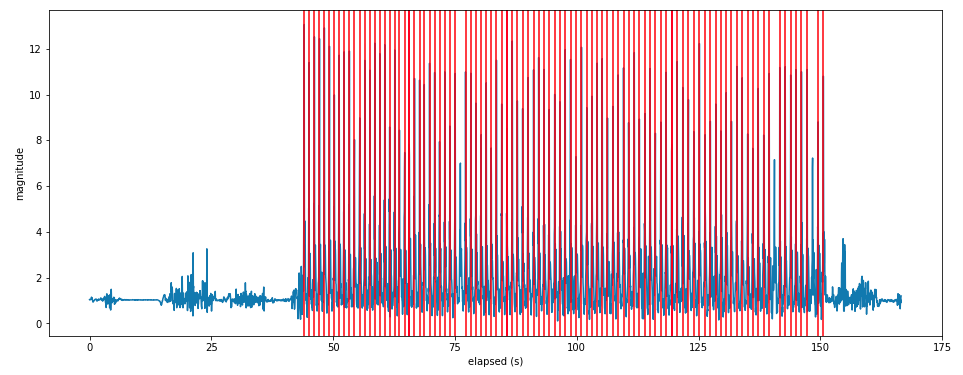
Exhibit A - 100 punches thrown, took 100 of the top values, correctly identified 97 of them with basic method.